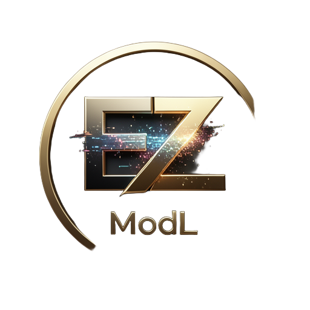

# EZmodL

> GGUF Model Manager for llama-swap — browse HuggingFace, download, manage models, all in one place.

<p align="center">
  
</p>

<p align="center">
  <strong>A lightweight web UI to manage your local GGUF model collection.</strong>
</p>

---

## ✨ Features

- 🔍 **Built-in HuggingFace search** with a curated list of known 2026 curators (bartowski, mradermacher, unsloth...)
- 📦 **Browse directly by owner/repo** or paste a HuggingFace URL
- 🎯 **Dynamic VRAM classification**: 🟢 Comfortable / 🟡 Tight / 🔴 Won't fit, against your configurable budget
- 🔗 **Ollama blob symlink detection** — avoids duplicates on disk, saves gigabytes
- ⬇️ **Download queue** with a smooth progress bar and history
- 🔧 **Auto-add to `llama-swap.yaml`** with automatic reload
- 🎨 **Dark futurist UI** — CSS is exposed and fully themeable
- 🚀 **Launches in an isolated Firefox WebApp** (OllamaUI pattern)

## 📦 Compatibility

**Tested on:**
- ✅ Ubuntu 24.04 (noble)
- ✅ Linux Mint 22.x (xia / wilma / zara)

**Should work, but untested** — same apt base, no reports either way:
- Debian 13 (trixie)
- Pop!_OS 24.04

Non-apt distros (Fedora, Arch, openSUSE): system dependencies must be installed manually.

## 🚀 Quick install

```bash
git clone https://github.com/miradorventus/EZmodL.git
cd EZmodL
EZMODL_LOCAL_INSTALL=1 bash install.sh
```

Or as a one-liner:

```bash
curl -fsSL https://raw.githubusercontent.com/miradorventus/EZmodL/main/install.sh | bash
```

📌 The installer downloads the files, installs system dependencies (via `pkexec`), sets up the menu and desktop entries, and tells you if anything is missing.

## 🔧 Requirements

EZmodL is designed to work **with llama-swap**, so you need:

- `llama-swap` configured (`~/.llamaui/config/llama-swap.yaml`)
- `llama.cpp` built with your backend (Vulkan / CUDA / ROCm)

For a fully automated llama.cpp + llama-swap setup on AMD, see [ollama-amd-plug-and-play](https://github.com/miradorventus/ollama-amd-plug-and-play).

## 🎬 Usage

1. Launch **EZmodL** from the Applications menu
2. Search for a model (e.g. `Qwen3`) or paste a repo (`bartowski/Qwen_Qwen3-14B-GGUF`)
3. Set your KV cache VRAM target
4. Tick the quantization(s) you want
5. EZmodL handles the download, detects duplicates, adds the entry to the YAML, and reloads llama-swap

## 🛠️ Configuration

All configuration lives in `~/.ezmodl/`:

```
~/.ezmodl/
├── config/
│   ├── preferences.json    # VRAM target, sort order, curators_only, theme
│   └── curators.txt        # Editable curator list
├── queue/                  # Download queue and history
└── logs/                   # Activity log
```

**Editing the curator list** (add or remove):

```bash
nano ~/.ezmodl/config/curators.txt
```

## 🎨 Theming

The CSS is exposed at `~/.ezmodl/static/style.css`. CSS variables sit at the top of the file:

```css
:root[data-theme="dark-futurist"] {
  --bg-base: #0a0e1a;
  --text-accent: #00d9ff;
  /* ... */
}
```

You can build your own theme by adding a `:root[data-theme="my-theme"]` block.

## 🗂️ Architecture

| Component | Role |
|---|---|
| `server.py` | Flask backend, exposes a REST API |
| `lib/hf_api.py` | HuggingFace API wrapper (search + tree) |
| `lib/vram_classify.py` | AMD/NVIDIA VRAM detection and quantization classification |
| `lib/disk_search.py` | Multi-folder search and symlink creation |
| `lib/yaml_helper.py` | Add/remove models in `llama-swap.yaml` |
| `lib/parse_quant.py` | Extracts the quantization from a filename |
| `templates/index.html` | Main UI (collapsible sections) |
| `static/app.js` | Vanilla JS, fetches the REST endpoints |
| `ezmodl.sh` | Launcher, OllamaUI pattern (lockfile, integrity check) |

## ❌ Uninstall

```bash
cd EZmodL
bash uninstall.sh
```

GGUF models in `~/llm-models/` are kept. `llama-swap.yaml` is left untouched — clean it up yourself if needed.

## 📋 V1 limitations

- No bulk actions on installed models (planned)
- No side-by-side model comparison (separate project)
- VRAM re-classification is based on total detected VRAM, not live free VRAM
- Curator list is editable through the text file only
- No caching of HuggingFace search results

## 🤝 Contributing

Issues and PRs welcome. This project is deliberately simple and minimal — let's keep it that way.

## 📜 License

MIT — see [LICENSE](LICENSE).

## 🙏 Credits

- [llama.cpp](https://github.com/ggml-org/llama.cpp)
- [llama-swap](https://github.com/mostlygeek/llama-swap)
- GGUF curators: bartowski, mradermacher, unsloth, ggml-org, and all the others
- Built with 🤖 by [miradorventus](https://github.com/miradorventus)

---

**EZmodL** — because managing GGUFs shouldn't be a chore.
